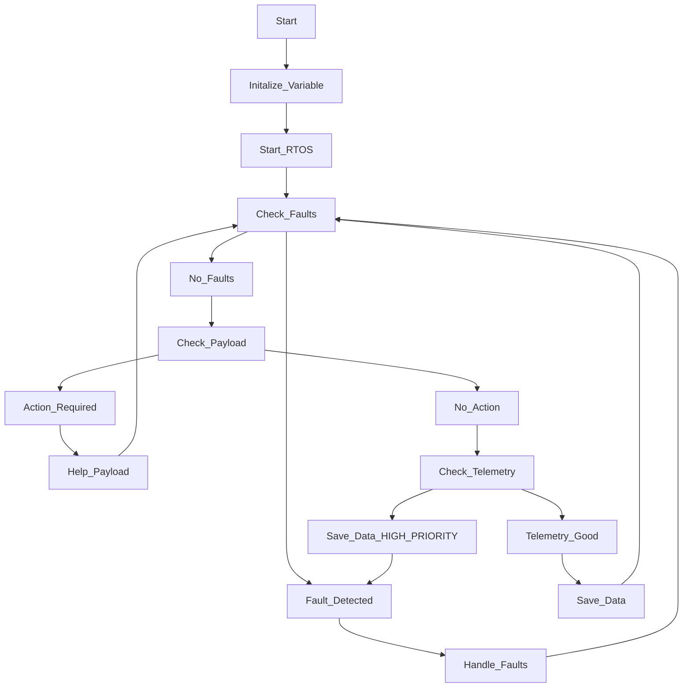

# Bowie
OBC code for STM32. Drivers and OS written for the were written by me for my specific applications. All files were generated by STM32CUBEMX.

```mermaid
flowchart TD
  Start-->Initalize_Variable;
  Initalize_Variable-->Start_RTOS;
  Start_RTOS-->Check_Faults;
  Check_Faults-->Fault_Detected-->Handle_Faults
  Handle_Faults-->Check_Faults
  Check_Faults-->No_Faults-->Check_Payload
  Check_Payload-->Action_Required-->Help_Payload-->Check_Faults
  Check_Payload-->No_Action-->Check_Telemetry
  Check_Telemetry-->Telemetry_Good-->Save_Data-->Check_Faults
  Check_Telemetry-->Save_Data_HIGH_PRIORITY-->Fault_Detected
```
## Diagrams

